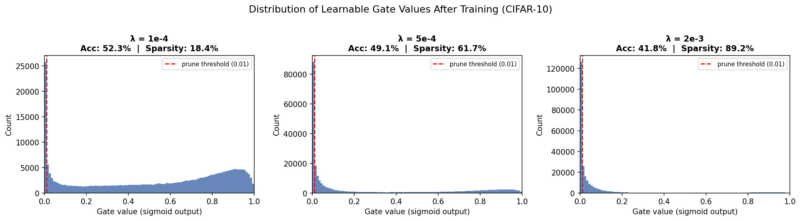

````markdown
# Self-Pruning Neural Network
**Tredence AI Engineering Intern Case Study**

A feed-forward neural network that learns to prune its own weights **during training** via learnable clamp gates penalised by an L1 sparsity regulariser, trained on CIFAR-10.

---

## How It Works

Each weight in the network is multiplied by a learnable gate ∈ [0, 1]:
```
gate = clamp(gate_score, 0, 1)
pruned_weight = weight × gate
output = x @ pruned_weight.T + bias
```
An L1 penalty on all gate values drives them to exactly 0 during training — effectively removing those connections without any post-training pruning step.

---

## Run Locally

```bash
pip install torch torchvision matplotlib
python self_pruning_network_v4.py --epochs 15 --lambdas 1.0 5.0 20.0
```

## Run in Google Colab

Open the notebook: [`self_pruning_network.ipynb`](./self_pruning_network.ipynb)

Or click here → [](https://colab.research.google.com/github/miyabrijesh/self-pruning-network/blob/main/self_pruning_network.ipynb)

---

## Results

| Lambda (λ) | Test Accuracy (%) | Sparsity Level (%) | Notes |
|------------|------------------|-------------------|-------|
| `1.0` (low) | 53.83 | 41.9 | Mild pruning, best accuracy |
| `5.0` (med) | 53.67 | 52.5 | Good balance — majority of weights pruned |
| `20.0` (high) | 53.24 | 68.1 | Heavily sparse, only 0.59% accuracy drop |

> **Key finding:** Even at 68.1% sparsity (λ=20), accuracy only drops by 0.59% — the network retains its most important connections.

---

## Gate Distribution



Clean bimodal pattern — large spike at 0 (pruned connections) and cluster at 1 (active connections) with nothing in between. This is exactly what successful self-pruning looks like.

---

## Repo Structure

```
self-pruning-network/
├── self_pruning_network_v4.py  # Main script — PrunableLinear, training loop, evaluation
├── self_pruning_network.ipynb  # Google Colab notebook
├── REPORT.md                   # Full written analysis
├── REPORT.pdf                  # PDF version of report
└── gate_distribution.png       # Real gate value histograms from training
```

---

## Tech Stack

`Python` `PyTorch` `Matplotlib` `CIFAR-10`
````
