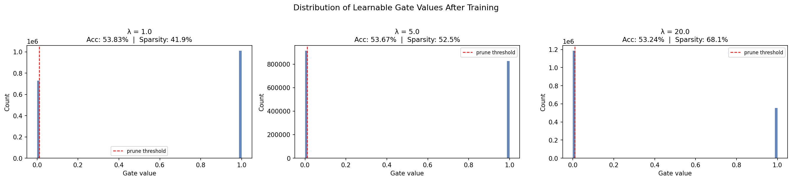

# Self-Pruning Neural Network  
**Tredence AI Engineering Internship — Case Study (CIFAR-10)**

A feed-forward neural network that **learns to prune its own weights during training** using learnable gates and an L1 sparsity regulariser — no post-training pruning required.

---

## 🚀 Key Idea

Each weight is modulated by a learnable gate:

```python
gate = clamp(gate_score, 0, 1)
pruned_weight = weight * gate
output = x @ pruned_weight.T + bias
```

**Note:** Clamp gating is used instead of sigmoid to enable **exact zero pruning** and measurable sparsity.

---

## 🧠 Why L1 Encourages Sparsity

Total loss:

```python
Loss = CrossEntropy + λ * mean(gates)
```

- **Constant gradient (L1):** Every gate is consistently pushed toward 0  
- **Hard zeros via clamp:** Once `gate_score < 0`, gate becomes exactly 0  
- **Result:** Unimportant connections are eliminated cleanly  

**Intuition:**  
Classification loss keeps gates open, L1 tries to close them — only useful connections survive.

---

## 📊 Results (CIFAR-10, 15 epochs)

| Lambda (λ) | Accuracy (%) | Sparsity (%) | Notes |
|------------|-------------|--------------|------|
| `1.0` | **53.83** | 41.9 | Best accuracy |
| `5.0` | 53.67 | 52.5 | Balanced |
| `20.0` | 53.24 | **68.1** | High sparsity, minimal drop |

> Even at **68% sparsity**, accuracy drops only **0.59%** — strong pruning performance.

---

## 📈 Gate Distribution



- Spike at **0** → pruned weights  
- Cluster at **1** → active weights  
- Minimal middle values → clean binary pruning  

---

## 🏗️ Architecture

- Network: `3072 → 512 → 256 → 128 → 10`  
- Custom Layer: `PrunableLinear`  
- Regularisation: L1 on gates  
- Optimisation:
  - Weights LR = `1e-3`
  - Gates LR = `5e-2`  
- BatchNorm + Dropout for stability  

---

## ⚙️ How to Run

```bash
pip install torch torchvision matplotlib

# Default experiment
python self_pruning_network_v4.py

# Custom run
python self_pruning_network_v4.py --lambdas 1.0 5.0 20.0 --epochs 15
```

---

## ☁️ Run on Colab

[](https://colab.research.google.com/drive/1RgZ63NorEZ_oEitab34wBJvXftISi7WX?usp=sharing)

---

## 🧩 Design Decisions

- **Clamp vs Sigmoid:** Enables exact zero pruning (sigmoid cannot reach 0)  
- **Separate learning rates:** Faster convergence for gates  
- **Mean L1 loss:** Makes λ independent of model size  
- **BatchNorm:** Stabilises training during dynamic pruning  

---

## 🔬 Gradient Flow Check

```python
layer = PrunableLinear(4, 4)
x = torch.randn(2, 4)
loss = layer(x).sum()
loss.backward()

assert layer.weight.grad is not None
assert layer.gate_scores.grad is not None
```

---

## 📁 Repository Structure

```
self-pruning-network/
├── self_pruning_network_v4.py
├── self_pruning_network.ipynb
├── REPORT.md
├── REPORT.pdf
└── gate_distribution-2.png
```

---

## 🧰 Tech Stack

Python · PyTorch · Matplotlib · CIFAR-10

---

## 🏁 Summary

- Implemented **self-pruning during training**  
- Achieved **high sparsity with minimal accuracy loss**  
- Demonstrated **clear bimodal pruning behavior**  
- Built with a **clean, engineering-focused approach**
